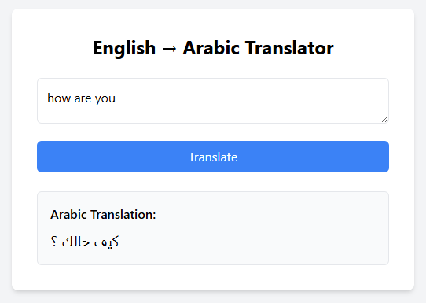
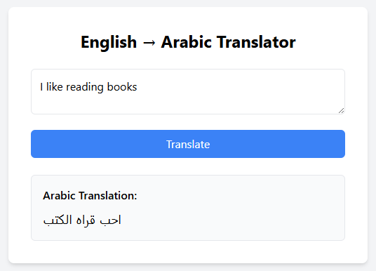
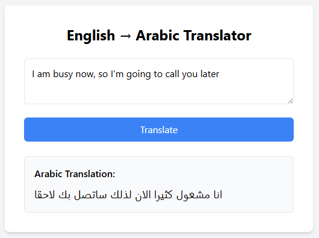

# 🌍 Language Translation (English -> Arabic)

This project is a  web app built with **FastAPI** and a **BERT Encoder–Decoder** model.  
It allows users to translate text between **English ↔ Arabic** in real time using Hugging Face models.

---

## 📂 Project Structure

```

Language Translation/
│── app.py                          # FastAPI application entry point
│── finetune-bert-translation.ipynb # Notebook for fine-tuning BERT translation model
│── templates/                      # Jinja2 HTML templates for frontend
│── imgs/                           # Images for documentation / UI preview
│── text/                           # Example input/output text files
│── .env.example                    # Contains  Hugging Face API key
│── .gitignore                      # Ignored files
│── README.md                       # Project documentation

````

---

## 🚀 Features
- **English -> Arabic translation** powered by Hugging Face Transformers.  
- **FastAPI Web App** with a simple and responsive frontend.  
- **BERT Encoder–Decoder Fine-Tuning** included in Jupyter Notebook.  

---

## ⚙️ Setup Instructions

1. **Clone the Repository**
   ```bash
   git clone https://github.com/drisskhattabi6/Language-Translation-using-Finetuned-BERT.git
   cd Language-Translation-using-Finetuned-BERT
````

2. **Install Dependencies** (no venv required)

   ```bash
   pip install fastapi uvicorn "python-dotenv" torch transformers jinja2
   ```

3. **Configure Environment Variables**

   * Rename `.env.example` to `.env`:

     ```bash
     mv .env.example .env
     ```
   * Open `.env` and add your Hugging Face API key:

     ```
     HF_TOKEN=your_huggingface_api_key_here
     ```

---

## ▶️ Run the App

Start the FastAPI server:

```bash
uvicorn app:app --reload
```

Then open your browser at:

```
http://127.0.0.1:8000
```

---

## 📒 Training & Fine-Tuning

*the Jupyter Notebook `finetune-bert-translation.ipynb` contains the fine-tuning process of BERT model.

---

## 🖼️ Screenshots







---

## 📌 Requirements

* Python 3.8+
* FastAPI
* Uvicorn
* PyTorch
* Hugging Face Transformers
* python-dotenv
* Jinja2
